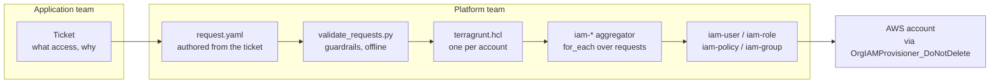

# AWS IAM Mgmt Framework

A Terraform/Terragrunt framework for centrally managing account-local IAM
resources (users, roles, groups, customer-managed policies) across many AWS
accounts. It's entirely platform-team-owned: application teams file a
ticket describing what they need, the platform team turns that into a
small request file, and the platform validates it against guardrails and
deploys exactly the account it touches.

## Architecture



Each account gets its own Terraform state key, of the form
`<env>/<account_id>/terraform.tfstate` -- one state file covers every
user/role/policy/group for that account, so a change to one account can
never affect another's state. `live/_components/iam-account` is what
composes the four per-component aggregators (users/roles/policies/groups)
into that single per-account Terraform run.

A fourth request type, **groups** (`modules/iam-group`,
`live/_components/iam-groups`), is supported end-to-end the same way, but
doesn't yet have a deployed example.

For the full design rationale (why modules are single-identity, folder
ownership, state isolation details), see
[docs/architecture.md](docs/architecture.md).

## Prerequisites

Before this can deploy against a real account, that account needs three
things that don't come from this repo's own `terragrunt plan`/`apply` --
they're a one-time bootstrap per account:

1. The `org-mandatory-permissions-boundary` managed policy.
2. The `OrgIAMProvisioner_DoNotDelete` role -- this is what gets assumed
   (see the diagram above) and its own permissions are intentionally
   scoped to IAM provisioning, not full admin.
3. A Terraform state bucket (`TG_STATE_BUCKET`) and region
   (`TG_STATE_REGION`) for Terragrunt's backend to write to.

`bootstrap/iam-provisioner.yaml` creates the first two in one account;
deploy it as a CloudFormation StackSet to cover every account
automatically, including new ones as they join. See
[bootstrap/README.md](bootstrap/README.md) for the exact commands. The
state bucket/region are supplied separately as environment variables
wherever `terragrunt` runs (see [docs/ci-cd.md](docs/ci-cd.md)).

## Submitting a request

This is all platform-team work: a request file lives under
`requests/<env>/<account_id>/<component>/<name>/`, authored from an
application team's ticket. Pick the request type below that matches what
they need.

### User (legacy applications only)

Create `requests/<env>/<account_id>/users/<name>/request.yaml`:

```yaml
account_id: "999999999999"
environment: prod

identity:
  type: legacy_iam_user
  name: sandbox-test-user
  owner: platform-team@example.com

business_reason: "Legacy application cannot assume an IAM role"
exception_ticket: "SEC-1234"
expires_on: "2027-03-31"

policy:
  type: custom
  file: custom-policy.json
```

`business_reason`, `exception_ticket`, and `expires_on` are mandatory --
see [docs/validation-rules.md](docs/validation-rules.md). Full example:
[`requests/prod/999999999999/users/sandbox-test-user/`](requests/prod/999999999999/users/sandbox-test-user/).

### Role

Create `requests/<env>/<account_id>/roles/<name>/request.yaml`:

```yaml
account_id: "999999999999"
environment: prod

identity:
  type: aws_service_role
  name: sandbox-role-managed-and-custom
  owner: platform-team@example.com

trust:
  service: lambda.amazonaws.com

policies:
  aws_managed:
    - arn:aws:iam::aws:policy/service-role/AWSLambdaBasicExecutionRole
  custom:
    - name: SandboxRoleCustomAccess
      file: custom-policy.json
```

Every AWS-managed ARN must be pre-approved in
`guardrails/allowed-aws-managed-policies.yaml`. Full example:
[`requests/prod/999999999999/roles/sandbox-role-managed-and-custom/`](requests/prod/999999999999/roles/sandbox-role-managed-and-custom/).

### Standalone policy

Create `requests/<env>/<account_id>/policies/<name>/request.yaml`:

```yaml
account_id: "999999999999"
environment: prod

name: SandboxStandaloneRead
owner: platform-team@example.com
description: "Read-only access to the sandbox test bucket"

file: policy.json
```

Full example:
[`requests/prod/999999999999/policies/sandbox-standalone-read/`](requests/prod/999999999999/policies/sandbox-standalone-read/).

### Group

Create `requests/<env>/<account_id>/groups/<name>/request.yaml`:

```yaml
account_id: "<account_id>"
environment: prod

identity:
  type: iam_group
  name: reporting-group
  owner: reporting-team@example.com

policies:
  aws_managed:
    - arn:aws:iam::aws:policy/CloudWatchReadOnlyAccess
  custom:
    - name: ReportingGroupAccess
      file: custom-policy.json

members:
  - reporting-app
```

No live example yet -- IAM groups can't carry a permissions boundary or tags of their own (only the custom policy gets tagged).

## Test coverage

Run `make check` for all of it (fully offline, no AWS credentials needed).

**Guardrail + changed-target tests** (`tests/test_framework.py`, 23 cases):

| Valid requests | Rejected requests | Changed-target scoping |
|---|---|---|
| user + custom policy | wildcard action | account A change selects only account A |
| standalone custom policy | wildcard resource | account B never selected by an account A change |
| role + AWS-managed policy | prohibited IAM admin action | same-account files (same component) dedupe to one target |
| role + AWS-managed + custom | missing owner | same-account files (different components) dedupe to one target |
| group + AWS-managed + custom + members | missing exception ticket (user) | `modules/`/`guardrails/` change requires controlled rollout |
| | expired request (user) | ...but is scoped once a rollout manifest is supplied |
| | unknown AWS-managed policy ARN | `requests/common/` change can span multiple accounts |
| | account ID / path mismatch | |
| | missing custom policy file | |
| | invalid policy JSON | |

**Terraform mock-provider tests** (`terraform test`, no AWS credentials, 8 runs across 4 modules): user with boundary and no credentials; role with AWS-managed only, AWS-managed + custom, and an EC2 instance profile; policy with default path/tags and with optional tags; group with AWS-managed only and with custom policy + members.

**Verified against a real AWS account** (created, independently checked via `aws iam get-*`, then destroyed and re-verified gone): user + custom policy (confirmed zero access keys/login profile), role + AWS-managed only, role + AWS-managed + custom, role + EC2 instance profile, standalone policy.

## Learn more

- [docs/architecture.md](docs/architecture.md) -- module/aggregator design, folder ownership, account & state isolation
- [docs/validation-rules.md](docs/validation-rules.md) -- guardrail rules, allowed AWS-managed policies, adding a new one
- [docs/security.md](docs/security.md) -- why no access keys, the key-rotation service design, safety guarantees
- [docs/ci-cd.md](docs/ci-cd.md) -- the CI/CD pipeline contract (validate/plan/apply), required repo config, local testing commands
- [docs/add-new-account.md](docs/add-new-account.md) -- how to onboard a new AWS account
- [docs/deleting-resources.md](docs/deleting-resources.md) -- how to remove a user, role, policy, or group

## License

[MIT](LICENSE)
